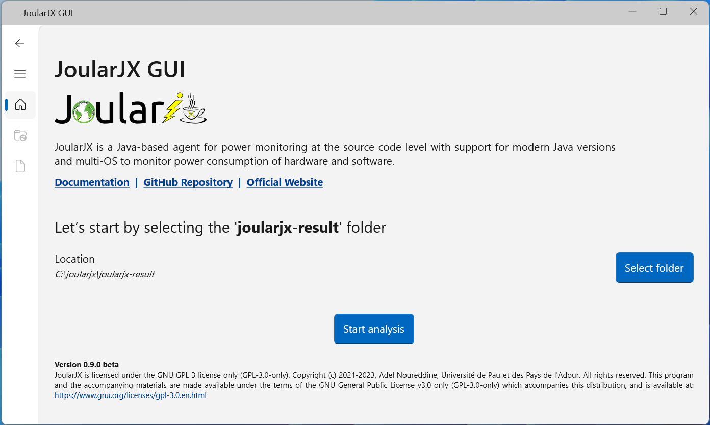

# joularjx-reader
JoularJX Reader is a GUI application to read and process the energy and data generated by JoularJX

## :camera_flash: Graphical User Interface (GUI)

JoularJX GUI is a graphical interface that reads the generated folder and files, and displays power and energy consumption, along with analysis, of the various methods and execution branches.

JoularJX GUI adopts WinUI 3 style and is currently only available on Windows, and in a beta release.

To compile the GUI, open the project (in the ```GUI``` folder) in Visual Studio and compile there.
Or open, Developer Command Prompt for VS (or Developer PowerShell for VS), and compile with this command:
```
msbuild.exe joularjx-gui.sln /property:Configuration=Release
```

<figure>
  
  <figcaption>Main interface of JoularJX GUI</figcaption>
</figure> 

## :newspaper: License

JoularJX is licensed under the GNU GPL 3 license only (GPL-3.0-only).

Copyright (c) 2023, Adel Noureddine, Université de Pau et des Pays de l'Adour.
All rights reserved. This program and the accompanying materials are made available under the terms of the GNU General Public License v3.0 only (GPL-3.0-only) which accompanies this distribution, and is available at: https://www.gnu.org/licenses/gpl-3.0.en.html